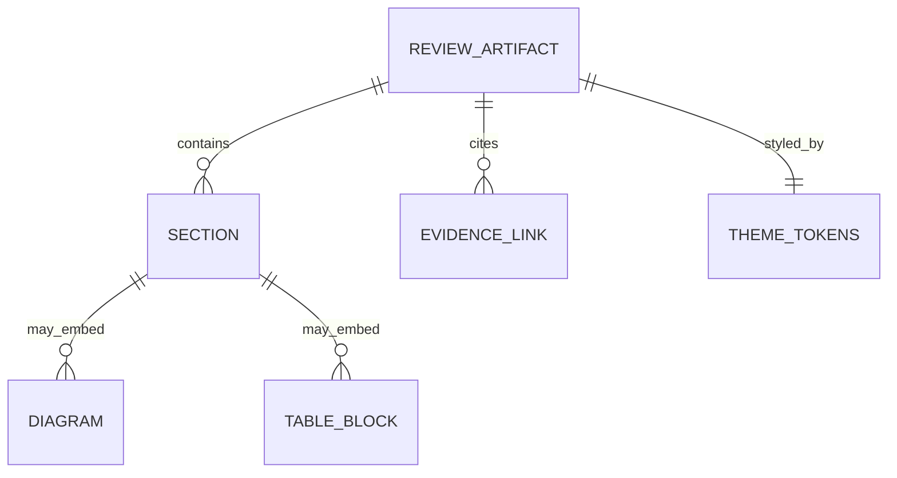
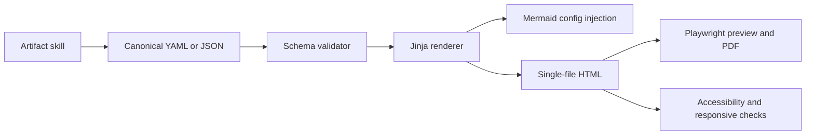
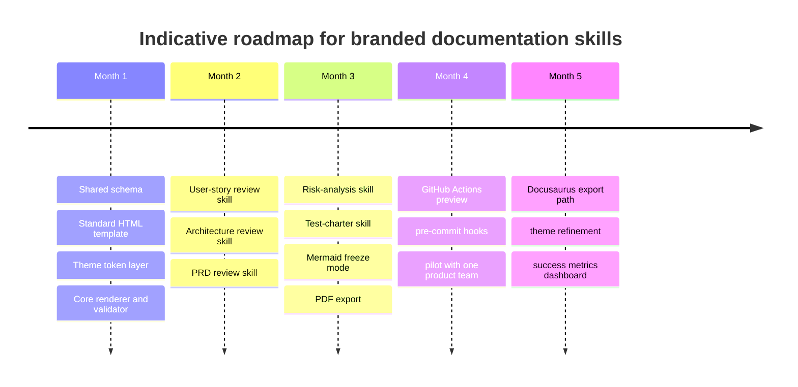

# Branded HTML Documentation Skills Research

## Document labels

Use this report content for both requested Markdown deliverables:

- `research_branded_doc_skill.md`
- `research_branded_doc_skill_en.md`

Because the requested output language is English, the English version can be identical to the main document.

## Executive summary

The best way to build this capability is **not** to ask an agent to directly emit large, styled HTML pages from scratch every time. The stronger pattern, supported by Anthropic’s skills model and by the most relevant existing skills, is a **schema-first, renderer-second architecture**: thin agent skills produce compact structured source, while a deterministic renderer applies the company theme, Mermaid configuration, and HTML template. Anthropic’s official skills guidance explicitly encourages concise `SKILL.md` files, supporting files loaded only when needed, and script-backed visual output, while also warning that invoked skill content stays in context and is later compacted under a bounded token budget. citeturn33view0turn33view1turn33view2turn33view3

The existing ecosystem already proves the core interaction model. `walkthrough` shows that an agent skill can generate a self-contained HTML artifact with Mermaid diagrams, code snippets, pan-and-zoom, and no build step. `visual-explainer` shows that agents can proactively route dense reviews, diff analyses, plans, and comparison tables into styled HTML rather than unreadable terminal output. Ring’s public material shows the same split: its Mermaid skill opens lightweight `mermaid.live` URLs, while richer, branded self-contained HTML is routed to a separate “visual explainer” capability or the current `ring:visualize` entry in its README. citeturn17view0turn17view1turn17view2turn17view3turn18view3turn18view4turn18view5turn20view0turn23view0turn29view0

For your use case, the recommended product is a **suite of seven skills**: one orchestrator, five artifact specialists for user stories, architecture, PRDs, risk analysis, and test charters, and one renderer-validator layer. The canonical output should be **compact YAML or JSON validated by JSON Schema**, not raw HTML. That design directly supports git-friendly diffs, reliable regeneration, and lower agent token usage. JSON Schema is explicitly designed to provide consistency, validity, and interoperability for JSON data, and Anthropic’s own skills model rewards this kind of separation of concerns. citeturn6search3turn6search6turn33view0turn33view1

For rendering, the strongest default is **single-file HTML first**, with an **optional Docusaurus publication path** later. Mermaid supports site-level initialization and theme configuration, while its official CLI can render SVG, PNG, and PDF or transform Markdown containing Mermaid diagrams. Docusaurus is excellent when these artifacts later need site navigation, search, and versioning, but it is heavier than necessary for immediate review artifacts. citeturn14view0turn14view1turn14view3turn31view1turn31view2turn26view0turn26view1turn26view2turn26view3

The biggest technical differentiator should be **output-token friendliness**. The model should author only the parts humans need to review: summaries, findings, evidence references, table rows, and Mermaid source. Boilerplate HTML, CSS, JS, print styles, and accessibility hooks should be deterministic renderer output. That same principle appears in documented skill guidance and in current research on structured, incremental documentation generation: a 2026 RepoDoc study reported substantially lower token usage and faster regeneration when documentation was produced from a structured semantic layer rather than regenerated flat from source fragments. citeturn33view0turn33view2turn13academia21

## Goals and target users

The suite should serve a narrow, high-value purpose: **turn agent-generated analysis into reviewable, visually clear, company-themed HTML artifacts that humans can approve, discuss, and archive**. The initial artifact classes should be user story reviews, architecture docs, PRD reviews, risk analyses, and exploratory test charters, because all of them repeatedly need the same primitives: executive summaries, evidence links, findings tables, status badges, and one or more diagrams. GitHub’s native Mermaid support in issues, discussions, pull requests, wikis, and Markdown files also makes Mermaid a practical fallback format for collaboration outside the branded HTML view. citeturn24view0

The target audience is broader than engineering. Product managers need requirement and story reviews that make scope gaps and assumptions obvious. Architects need topology, interaction, and deployment views. QA leads need risk concentration, mitigation coverage, and test-charter structure. Engineering leads need architecture plus readiness snapshots. Delivery stakeholders need compact timelines and risk summaries. Mermaid’s official syntax coverage is broad enough to support these personas with architecture diagrams, ER diagrams, user journeys, timelines, flowcharts, and sequence diagrams from one syntax family. citeturn14view2turn15search0turn15search1turn15search2turn15search7

A practical target-user model is below.

| Target user | Primary review need | Best initial artifact style | Visual emphasis |
|---|---|---|---|
| Product manager | requirement clarity, scope gaps, dependencies | PRD review, user-story review | summaries, acceptance tables, journey diagrams |
| Architect | topology, interfaces, design trade-offs | architecture review | architecture and sequence diagrams, ADR blocks |
| QA lead | risk, coverage, exploratory structure | risk analysis, test charter | risk matrix, state and journey visuals |
| Engineering lead | implementation readiness, evidence-backed review | architecture and PRD composite | decisions, evidence links, dependency maps |
| Delivery stakeholder | timing, confidence, blockers | roadmap/review recap | timeline, status badges, concise KPI panels |

Two assumptions are necessary because they were not specified. First, **company theme details are unspecified**, so the system should be built around semantic theme tokens rather than fixed colors and fonts. Second, **budget and staffing are unspecified**, so the roadmap later in this report uses indicative planning assumptions, not user-provided estimates.

## Existing landscape and renderer options

The current market already contains strong building blocks, but there is still a clear gap between “Mermaid generation” and “token-efficient branded review documents.”

### Existing skills and tools

| Skill or tool | What the public source shows | Why it matters for this program | Main limitation |
|---|---|---|---|
| Ring branded HTML explainer pattern | Ring’s README currently lists `ring:visualize` as a self-contained HTML explanation skill, while Ring’s `drawing-diagrams` skill says to use `ring:visual-explainer` instead when the user needs rich, branded HTML rather than a `mermaid.live` link. citeturn23view0turn29view0 | Confirms that branded HTML explainers are already useful in real agent workflows. | Public docs show capability intent, but not enough implementation detail to reuse it directly. |
| `walkthrough` | Creates a self-contained HTML file with clickable Mermaid diagrams, detail panels, code snippets, pan and zoom, dark mode, and no build step; uses React 18, Tailwind CSS, Mermaid 11, and Shiki from CDNs. citeturn17view0turn17view1turn17view2turn17view3 | Excellent proof that interactive HTML walkthroughs work well for code understanding and review. | More “codebase walkthrough” than “controlled enterprise document renderer.” |
| `visual-explainer` | Produces self-contained HTML pages and slide decks for diagrams, diff reviews, plan reviews, recaps, and dense tables; uses templates, references, and proactive HTML rendering. citeturn18view3turn18view4turn18view5turn20view0 | Best current design reference for replacing terminal-heavy reviews with browser-native artifacts. | Not explicitly optimized for a compact, validated canonical source model. |
| `mermaid-tools` | Extracts Mermaid diagrams from Markdown and renders numbered `.mmd` plus high-resolution PNG outputs through scripts. citeturn16view2 | Useful companion utility for export, extraction, and CI rendering workflows. | Not a themed HTML documentation system. |
| `create-mermaid-diagrams` | MCP service that converts text descriptions into Mermaid diagrams for documentation and planning. citeturn16view4 | Good diagram-generation helper or fallback generator. | Focused on diagram production, not full artifact rendering. |
| Quarkdown | Compiles one Markdown-derived source into books, papers, knowledge bases, and interactive presentations. citeturn16view3 | Relevant if the program later expands into multi-format publishing. | Heavier than needed for single-file HTML review artifacts. |

The key conclusion from this comparison is that the market already proves **the value of HTML explainers** and **the value of Mermaid utilities**, but not yet the exact combination you need: a **company-themed, review-oriented, schema-driven document suite optimized for low model output volume**. The new suite should therefore borrow the UX strengths of `visual-explainer` and `walkthrough`, while explicitly avoiding “prompt-only HTML generation” as the primary production path. citeturn17view0turn18view3turn20view0

### Renderer options

| Renderer path | What the official docs show | Fit for this use case | Recommendation |
|---|---|---|---|
| Single-file HTML | Mermaid supports global initialization and theming; Jinja can generate HTML and any text format; Playwright handles screenshots, media emulation, and PDF export. citeturn14view0turn14view1turn14view3turn7search0turn7search1turn28view0turn28view1turn28view2 | Best for ad hoc review artifacts, local preview, email/share workflows, and deterministic build output. | **Recommended default** |
| Docusaurus | Static-site generator with out-of-the-box docs features; Mermaid works through `@docusaurus/theme-mermaid`; light/dark Mermaid theming and direct Mermaid options are supported. citeturn26view0turn26view1turn26view2turn26view3 | Best when these artifacts must evolve into a searchable, versioned portal. | **Recommended optional second stage** |
| Material for MkDocs | Native Mermaid support, automatic use of configured fonts/colors, strong customization; but the project announced maintenance mode in November 2025. citeturn25view0turn25view1turn27view0 | Attractive for Python-heavy teams already on MkDocs. | **Viable, but not the strategic default** |
| Eleventy | Simple static build output and hot-reload server, with lightweight templating and deployment patterns. citeturn25view2 | Good if the team wants a custom portal without a docs-specific framework. | **Useful, but Mermaid integration is more manual** |

The strategic recommendation is therefore straightforward: build **single-file HTML first**, then add a **Docusaurus export target** only when navigation, search, and versioning become requirements. Material for MkDocs is still usable, but its maintenance-mode announcement makes it a weaker long-term foundation for a new internal platform. citeturn26view2turn25view0turn27view0

## Proposed skill suite and schemas

The suite should be built from **thin, specialized skills** around one shared artifact schema. Anthropic’s official recommendations fit this problem exactly: keep `SKILL.md` concise, move heavy reference material into supporting files, and use bundled scripts for deterministic visual output. Anthropic also recommends keeping `SKILL.md` under 500 lines and notes that support files are loaded only when needed, which is directly relevant for token-sensitive design. citeturn33view0turn33view1turn33view3

### Prioritized skills to build

| Priority | Skill name | Purpose | Inputs | Outputs | Notes |
|---|---|---|---|---|---|
| High | `review-doc-orchestrator` | route requests, assemble canonical source, select template | artifact type, audience, evidence scope, theme token set | validated YAML/JSON source + HTML path | entry skill |
| High | `user-story-review-doc` | render reviewable user stories with acceptance criteria and journeys | story text, ACs, dependencies, risks | `user-story-review.yaml` + HTML | PM and design review |
| High | `architecture-review-doc` | render architecture summaries, interactions, decisions, constraints | notes, code evidence, ADRs, interfaces | `architecture-review.yaml` + HTML | architecture and eng review |
| High | `prd-review-doc` | render PRD review with coverage, scope, open questions, readiness | PRD text, goals, requirements, assumptions | `prd-review.yaml` + HTML | product and delivery review |
| High | `risk-analysis-review-doc` | render risk register, mitigations, controls, residual risk | risks, triggers, impact, controls | `risk-analysis.yaml` + HTML | QA, product, operations |
| Medium | `test-charter-review-doc` | render exploratory test charter and coverage boundaries | mission, heuristics, states, personas, exits | `test-charter.yaml` + HTML | QA review |
| High | `render-branded-html` | deterministically convert validated source into single-file HTML | schema-valid source + theme tokens + template | HTML, optional PDF, optional frozen SVG | script-backed |
| High | `validate-branded-doc` | lint schema, Mermaid, accessibility, responsive layout, export | source or rendered HTML | pass/fail report | CI and local hook |

This breakdown keeps artifact skills small and reusable. It also cleanly matches Anthropic’s “content skill plus support files plus script” pattern, rather than turning every output into a one-off prompt. citeturn33view1turn33view3

### Shared base schema

The agent should emit **one common base schema** with artifact-specific overlays. That keeps diffs readable and lets the renderer stay generic.

```yaml
schema_version: 1
artifact_type: architecture-review
title: Checkout Service Review
subtitle: Proposed payment orchestration changes
audience:
  - Engineering
  - QA
  - Product
status: draft
owner: Architecture Guild
updated_at: 2026-05-30
theme:
  mode: auto
  brand: default
  density: comfortable
summary:
  - Retry handling is underspecified for PSP timeouts.
  - Fraud decision ownership is split across services.
  - Observability requirements are incomplete.
sections:
  - id: context
    title: Context
    kind: prose
    body: >
      This review covers the checkout orchestration path for card payments.
  - id: sequence
    title: Current interaction flow
    kind: mermaid
    diagram_type: sequence
    source: |
      sequenceDiagram
        actor User
        participant Web
        participant API
        participant PSP
        User->>Web: Submit order
        Web->>API: POST /checkout
        API->>PSP: Authorize payment
        PSP-->>API: Result
        API-->>Web: Confirmation or error
  - id: findings
    title: Findings
    kind: table
    columns: [finding, severity, recommendation]
    rows:
      - [Retry policy undefined, high, Define retry/backoff and failure UX]
evidence:
  - label: ADR-17
    href: docs/adr/017-payment-orchestration.md
  - label: API checkout handler
    href: services/checkout/handler.ts
export:
  pdf: true
  freeze_diagrams: false
```

An equally compact JSON form is useful for CI, APIs, and tests:

```json
{
  "schema_version": 1,
  "artifact_type": "risk-analysis",
  "title": "Checkout Risk Review",
  "status": "draft",
  "summary": [
    "Timeout handling is unclear.",
    "Auditability is incomplete."
  ],
  "sections": [
    {
      "id": "risk-matrix",
      "title": "Risk matrix",
      "kind": "table",
      "columns": ["risk", "likelihood", "impact", "mitigation"],
      "rows": [
        ["PSP timeout without retry policy", "medium", "high", "Define retry policy and fallback UX"]
      ]
    }
  ]
}
```

### Artifact-specific overlays

The artifact specializations should extend the base, not replace it. For example:

- **User story review**: `as_a`, `i_want`, `so_that`, `acceptance_criteria`, `personas`, `journey_states`, `dependencies`
- **Architecture review**: `decisions`, `constraints`, `interfaces`, `deployment_context`, `alternatives`
- **PRD review**: `business_goals`, `out_of_scope`, `requirement_coverage`, `stakeholders`
- **Risk analysis**: `triggers`, `controls`, `residual_risk`, `owners`, `review_cadence`
- **Test charter**: `missions`, `heuristics`, `coverage_boundaries`, `exit_criteria`

A schema relationship model can stay simple:



That model is compact enough for agent generation while still supporting all five artifact classes.

## Architecture and implementation

The strongest architecture is a **clear split between agent responsibilities and renderer responsibilities**. The agent should decide *what the document says*; the renderer should decide *how the document looks*.

### Core architecture

Mermaid’s documentation is explicit that site-level configuration belongs in `mermaid.initialize`, while authors can optionally use frontmatter for selected per-diagram configuration. Jinja is explicitly built to generate HTML and other text formats from structured input. Combined with Anthropic’s script-backed skill pattern, that leads naturally to a layered architecture built around canonical source, validation, render, and preview. citeturn14view0turn14view1turn14view3turn7search0turn7search1turn33view3



A good responsibility split is below.

| Layer | Should do | Should not do |
|---|---|---|
| Artifact skill | classify request, collect evidence, author compact structured content | hand-author final HTML/CSS/JS |
| Shared schema | enforce required structure and field semantics | encode brand styling logic |
| Renderer | turn valid source into deterministic HTML | invent business content |
| Mermaid runtime | render diagrams from trusted source/config | act as the whole page layout engine |
| Validator | catch schema, diagram, a11y, responsive, and export issues | silently rewrite source semantics |

### Mermaid rendering strategy

The suite should support **two rendering modes**.

The first is **interactive review mode**. In this mode the HTML file contains Mermaid source and runs Mermaid client-side. This is best for zoomable diagrams, mode-sensitive theming, and rapid browser review. Mermaid’s usage docs recommend initialization-based config, and theming docs show that `theme: 'base'` plus `themeVariables` is the correct way to build a custom theme. citeturn14view0turn14view3

The second is **frozen archival mode**. In this mode the build step uses the official Mermaid CLI to render SVG first and then inlines SVG into the HTML. The official CLI supports SVG, PNG, and PDF output and can also transform Markdown files containing Mermaid into SVG-referenced Markdown. This is the better option for long-term archival, stable screenshots, and reliable PDF export. citeturn31view1turn31view2

The renderer should therefore expose a simple switch:

- `interactive=true` for browser review
- `freeze_diagrams=true` for CI, PDF, and archival

### Mermaid theming and brand mapping

Mermaid’s theme model matters here. The **`base` theme is the only modifiable theme**, and Mermaid’s `themeVariables` can control primary colors, line colors, text colors, font family, and derived visual states. Mermaid also supports different visual “looks” like `classic`, `handDrawn`, and `neo`, and its configuration schema shows these options directly. Mermaid’s syntax reference and Docusaurus docs also make clear that the heavier ELK layout engine can be enabled when needed for larger or more complex graphs. citeturn14view3turn30search0turn30search2turn26view0

That means the company-theme system should map semantic design tokens into both CSS and Mermaid variables.

| Brand token | Mermaid mapping | CSS mapping | Usage |
|---|---|---|---|
| `brand.primary` | `primaryColor`, `primaryBorderColor` | `--color-primary` | accents, buttons, node emphasis |
| `brand.text` | `primaryTextColor`, `textColor` | `--color-text` | body and label text |
| `brand.line` | `lineColor` | `--color-line` | connectors, borders, separators |
| `brand.background` | `background` | `--color-bg` | document canvas |
| `brand.surface` | none direct | `--color-surface` | cards, sections, callouts |
| `brand.fontSans` | `fontFamily` | `--font-sans` | primary body typography |
| `brand.fontMono` | none direct | `--font-mono` | code blocks, evidence excerpts |

A representative Mermaid config looks like this:

```html
<script type="module">
  import mermaid from './vendor/mermaid.esm.mjs';

  mermaid.initialize({
    startOnLoad: true,
    theme: 'base',
    securityLevel: 'strict',
    look: 'classic',
    fontFamily: 'Inter, Arial, sans-serif',
    themeVariables: {
      background: '#F8FAFC',
      primaryColor: '#DCEEFF',
      primaryBorderColor: '#0063B1',
      primaryTextColor: '#0F172A',
      lineColor: '#64748B',
      textColor: '#0F172A',
      fontFamily: 'Inter, Arial, sans-serif'
    }
  });
</script>
```

The recommended default `securityLevel` is `strict`. Mermaid documents that `strict` disables click functionality and encodes HTML tags, while looser modes allow interactivity but assume greater trust in diagram content. For internal review artifacts, `strict` should be the baseline, with `loose` used only when clickable nodes are a deliberate product requirement. citeturn14view0

### File layout and sample render pipeline

The package layout should mirror Anthropic’s support-file guidance and keep shared infrastructure centralized. citeturn33view1turn33view3

```text
.claude/
  skills/
    review-doc-orchestrator/
      SKILL.md
      references/
        routing.md
        artifact-types.md
    user-story-review-doc/
      SKILL.md
    architecture-review-doc/
      SKILL.md
    prd-review-doc/
      SKILL.md
    risk-analysis-review-doc/
      SKILL.md
    test-charter-review-doc/
      SKILL.md
    render-branded-html/
      SKILL.md
      schemas/
        review-artifact.schema.json
        user-story-review.schema.json
        architecture-review.schema.json
        prd-review.schema.json
        risk-analysis.schema.json
        test-charter.schema.json
      templates/
        standard.html.j2
        print.html.j2
      assets/
        theme.css
        print.css
        mermaid-config.js
      scripts/
        render.py
        freeze_mermaid.sh
        export_pdf.py
    validate-branded-doc/
      SKILL.md
      scripts/
        validate_schema.py
        validate_mermaid.mjs
        validate_accessibility.mjs
        validate_responsive.mjs
        validate_export.mjs
```

A minimal HTML skeleton should be deterministic and renderer-owned:

```html
<!doctype html>
<html lang="en">
<head>
  <meta charset="utf-8">
  <title>{{ artifact.title }}</title>
  <meta name="viewport" content="width=device-width, initial-scale=1">
  <style>{{ inline_css }}</style>
</head>
<body>
  <main class="doc-shell">
    <header class="hero">
      <p class="eyebrow">{{ artifact.artifact_type }}</p>
      <h1>{{ artifact.title }}</h1>
      <p class="lead">{{ artifact.subtitle }}</p>
    </header>

    
    <section id="{{ section.id }}" class="section section--{{ section.kind }}">
      <h2>{{ section.title }}</h2>
      
        <div class="prose">{{ section.body | safe }}</div>
      
        <div class="mermaid-wrap">
          <pre class="mermaid">{{ section.source }}</pre>
        </div>
      
        {{ render_table(section) }}
      
    </section>
    
  </main>
  <script type="module">{{ inline_mermaid_init }}</script>
</body>
</html>
```

A compact `render.py` pipeline can be built on Python CLI conventions, Jinja templating, and JSON Schema validation. Those choices are well aligned with official Python and Jinja documentation and keep the stack low-ceremony. citeturn6search2turn7search0turn7search1turn6search3

```python
#!/usr/bin/env python3
from __future__ import annotations

import argparse
import json
from pathlib import Path

import yaml
from jinja2 import Environment, FileSystemLoader, select_autoescape
from jsonschema import Draft202012Validator


def load_source(path: Path) -> dict:
    text = path.read_text(encoding="utf-8")
    if path.suffix.lower() in {".yaml", ".yml"}:
        return yaml.safe_load(text)
    return json.loads(text)


def validate_payload(payload: dict, schema_path: Path) -> None:
    schema = json.loads(schema_path.read_text(encoding="utf-8"))
    Draft202012Validator(schema).validate(payload)


def render_html(payload: dict, template_dir: Path, template_name: str, out_path: Path) -> None:
    env = Environment(
        loader=FileSystemLoader(str(template_dir)),
        autoescape=select_autoescape(["html", "xml"]),
        trim_blocks=True,
        lstrip_blocks=True,
    )
    html = env.get_template(template_name).render(artifact=payload)
    out_path.write_text(html, encoding="utf-8")


def main() -> None:
    parser = argparse.ArgumentParser(description="Render branded review HTML from canonical source.")
    parser.add_argument("--input", required=True)
    parser.add_argument("--schema", required=True)
    parser.add_argument("--template-dir", required=True)
    parser.add_argument("--template", default="standard.html.j2")
    parser.add_argument("--output", required=True)
    args = parser.parse_args()

    payload = load_source(Path(args.input))
    validate_payload(payload, Path(args.schema))
    render_html(payload, Path(args.template_dir), args.template, Path(args.output))


if __name__ == "__main__":
    main()
```

### Optional Docusaurus path

Docusaurus should remain an optional **second-stage publication target**, not the first implementation. It already supports Mermaid through `@docusaurus/theme-mermaid`, lets teams configure Mermaid light/dark themes and raw Mermaid options, and statically renders documentation content into HTML while still supporting richer navigation and React-based components. That makes it the cleanest path once generated artifacts need search, cross-linking, and versioning. citeturn26view0turn26view1turn26view2turn26view3

## Token efficiency, visual system, testing

Token efficiency is the core engineering requirement that differentiates this project from existing HTML-generation skills.

### Token-efficiency strategy

The first rule is to make **structured source canonical**. Anthropic’s skill lifecycle explicitly says that invoked skill content remains in context for the rest of the session, and that after summary compaction only the first 5,000 tokens of each invoked skill are reattached, within a shared 25,000-token budget. That means every unnecessary line in a skill or repeated HTML boilerplate is a direct tax on future turns. citeturn33view2

The second rule is to make the model generate **content, not chrome**. Existing HTML explainer skills are valuable references, but prompt-only HTML generation tends to repeat wrappers, utility classes, CSS declarations, and JS bootstrapping on every run. A schema-first renderer removes those repeated tokens and makes diffs much smaller. The same broad principle is supported by RepoDoc’s measured result that structure-aware, targeted regeneration dramatically lowered token usage relative to flat document generation. citeturn18view3turn13academia21

The third rule is to keep diagrams intentionally scoped. Mermaid is powerful, but very large diagrams become hard to review and easier to break. The artifact skills should default to “one main diagram per core section,” with an escape hatch for larger visuals when the user explicitly asks for them. ELK should be an intentional fallback for complexity, not the baseline. citeturn26view0turn30search0

Recommended first-release operating targets are below.

| Metric | Suggested target | Why it matters |
|---|---|---|
| Agent output size for canonical source | 2 KB to 12 KB per artifact | keeps review docs cheap to generate and revise |
| HTML boilerplate emitted by model | 0 KB by default | renderer should own templates |
| Typical Mermaid block size | under 40 lines | improves readability and lowers syntax failure risk |
| Invoked `SKILL.md` size | comfortably under Anthropic’s 500-line guidance | reduces recurring context cost |
| Regeneration granularity | section-level | avoids whole-document re-emission |
| Render mode default | interactive HTML, frozen optional | keeps review flow fast while preserving archival option |

### UX and visual style system

The visual system should be tokenized and semantic. Material for MkDocs is a useful reference because its Mermaid integration automatically uses site fonts and colors, showing how much easier documentation theming becomes when diagrams and page shell share one design system. Mermaid’s own theming model is built to support exactly this kind of mapping. citeturn25view0turn14view3

A practical token model should include at least:

```yaml
brand:
  name: Unspecified
  logo_url: null
  color:
    bg: "#F8FAFC"
    surface: "#FFFFFF"
    text: "#0F172A"
    text_dim: "#475569"
    line: "#64748B"
    primary: "#0063B1"
    primary_soft: "#DCEEFF"
    success: "#0F9D58"
    warning: "#F59E0B"
    danger: "#DC2626"
  font:
    sans: "Inter, Arial, sans-serif"
    serif: "Source Serif 4, Georgia, serif"
    mono: "JetBrains Mono, Consolas, monospace"
  radius:
    card: "16px"
  spacing:
    page_x: "24px"
    section_y: "32px"
```

The renderer should then map those tokens into section cards, hero blocks, table chrome, evidentiary sidebars, code blocks, Mermaid variables, and print styles. That approach also makes it easy to define a small number of **intent-based visual modes** such as editorial, blueprint, or risk dashboard without changing the underlying artifact schema.

### Testing and validation

Validation should run in layers.

**Schema validation** should always happen first. JSON Schema is the right standards-based contract for the canonical source layer. citeturn6search3turn6search6

**Mermaid validation** should happen second. The browser-side Mermaid API supports parse-time checks, and the official Mermaid CLI provides a deterministic render path to SVG, PNG, and PDF. In practice the best validator uses both: parse early for fast failures, then optionally render via CLI in CI for higher confidence. citeturn14view0turn31view1

**Accessibility validation** should run on final HTML output. Playwright’s accessibility guidance now points users to third-party libraries such as Axe, and Axe-core is explicitly built for automated accessibility testing of HTML-based interfaces. WCAG 2.2 still requires 4.5:1 contrast for normal text and 3:1 for large text, so the theme-token validator should enforce those thresholds. citeturn5search0turn5search1turn5search7turn5search3

**Responsive validation** should use Playwright screenshots and media emulation across desktop and mobile widths. Playwright supports screenshot capture, device and viewport emulation, dark/light emulation, reduced motion, and media switching. Responsive design is not optional for this use case because many review artifacts will be opened from links, comments, or chat environments on variable devices. citeturn28view1turn28view2turn8search2turn5search6

**Print and PDF validation** should use Playwright’s `page.pdf()` flow. Playwright documents that PDF export uses print CSS by default, can be switched to screen CSS through `page.emulateMedia()`, and may alter colors unless print color adjustment is handled explicitly. MDN’s print and paged-media guidance is the right companion for page size and margin control. citeturn28view0turn28view1turn8search1turn8search4turn8search6turn8search16

A practical validation matrix is below.

| Check | Tooling | Pass condition |
|---|---|---|
| Structural validity | JSON Schema | all required fields and enums valid |
| Mermaid syntax | Mermaid parse + Mermaid CLI | no parse errors and no render failures |
| Browser render | Playwright smoke test | loads without blocking console/runtime failures |
| Accessibility | Playwright + Axe | zero critical issues; contrast meets WCAG AA |
| Responsive layout | Playwright viewports | no clipping or uncontrolled horizontal overflow |
| Print/PDF | Playwright PDF export | usable pagination and readable diagrams |

## Roadmap, integration, risks, and open questions

### Implementation roadmap

A sensible rollout order is:

| Phase | Deliverables | Indicative outcome |
|---|---|---|
| Foundation | shared schema, renderer, base template, theme token model, validator | first deterministic branded HTML output |
| Artifact wave | user story, architecture, PRD skills | first real review workflows |
| QA wave | risk analysis and test charter skills | richer review suite coverage |
| Operations wave | Git hooks, CI preview, PDF export | team-ready workflow |
| Publication wave | Docusaurus export path, template refinements, metrics | portal-ready capability |

The roadmap below is indicative only. You did not provide staffing or budget, so this assumes one primary engineer with fractional design-system and QA/docs support.



### Migration and integration

The canonical YAML/JSON source should be what lives in git, because it is much easier to diff and review than generated HTML. The HTML can either be committed selectively or treated as a build artifact. If the team wants browser previews per pull request, GitHub Pages plus GitHub Actions is the cleanest route; GitHub’s official Pages flow uploads a built artifact and deploys it in a separate Pages deploy step. For teams that still want Markdown-native collaboration, GitHub already renders Mermaid in issues, discussions, PRs, wikis, and Markdown files, so the same diagram content can be republished as Markdown fallback where needed. citeturn4search0turn4search3turn4search9turn4search11turn24view0

A minimal operational path is:

1. `pre-commit` runs schema validation and quick Mermaid checks on changed canonical source files. citeturn4search1  
2. GitHub Actions renders HTML, runs Playwright and accessibility checks, and uploads preview artifacts. citeturn4search0turn5search0turn28view0  
3. Optional Pages deployment publishes the review artifact for stakeholders. citeturn4search9turn4search11

### Risks and mitigations

| Risk | Why it matters | Mitigation |
|---|---|---|
| Prompt drift across artifact skills | inconsistent structure and tone | one base schema, golden examples, renderer-owned layouts |
| Mermaid parse failures | broken diagrams damage trust | lint early, cap complexity, support frozen SVG fallback |
| Brand mismatch between page and diagrams | artifacts feel unpolished | single token source mapped to CSS and Mermaid |
| Skill context bloat | token cost rises over session lifetime | thin `SKILL.md`, heavy support files, script-backed render |
| Poor print output | PDFs become unusable for workshops or audits | dedicated print CSS and Playwright PDF tests |
| Accessibility regressions | excludes users and creates compliance risk | token checks, Axe scans, responsive baseline screenshots |
| Over-engineering too early | slows adoption | start with single-file HTML, defer portalization |

### Evaluation criteria and success metrics

Success should be measured across four dimensions:

| Dimension | Metric | Early target |
|---|---|---|
| Token efficiency | median agent output size for canonical source | materially smaller than final HTML and stable across artifact types |
| Reliability | schema pass rate + Mermaid render pass rate | above 95 percent after pilot hardening |
| Review usefulness | review completion time and issue-finding rate | improved vs plain Markdown or terminal output |
| UX quality | accessibility, responsive, and print pass rates | no critical a11y violations; stable mobile and PDF output |

### Open questions and limitations

The main unresolved item in the public research is **Ring’s exact current branded HTML implementation details**. Ring’s public repo clearly shows the pattern and current naming drift between `ring:visualize` and `ring:visual-explainer`, but it does not expose enough implementation detail to treat Ring itself as a drop-in template. That is not a blocker, because `walkthrough`, `visual-explainer`, Anthropic’s visual-output guidance, Mermaid’s official docs, and the Docusaurus path together provide enough evidence to design the new suite with high confidence. citeturn23view0turn29view0turn17view0turn18view3turn33view3

The final strategic recommendation is therefore clear: **build a schema-first, thin-skill, branded single-file HTML suite first; keep Mermaid interactive by default, freezeable on demand; and add a Docusaurus export path only after the artifact workflow proves itself.** That architecture is the best fit for token-efficient generation, reviewability, theming, CI integration, and long-term maintainability. citeturn33view0turn14view3turn31view1turn26view0turn13academia21